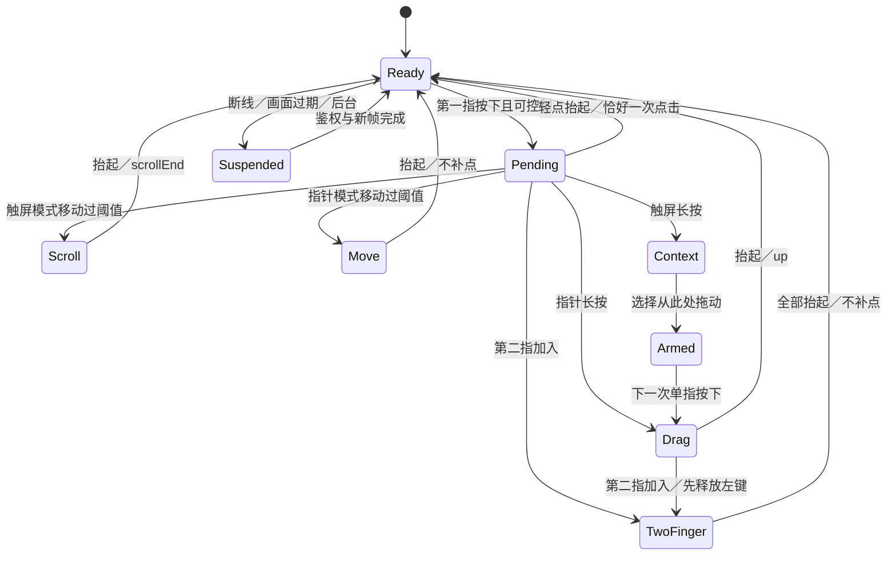
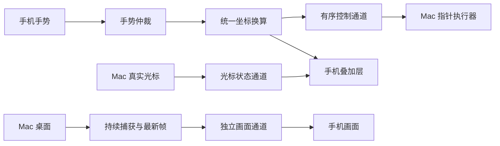

# PocketDesk 全屏工作台改造规划 V1.0

> 日期：2026-09-09。基线：`278ac69`，Web 资源版本 `2.9.23`；开始检查时工作区干净。
> 状态：2026-09-09 已按本方案落地首版。下文的缺陷行号与“当前实现”保留为改造前基线；实际完成范围、验证证据和待验收项见 FULLSCREEN_IMPLEMENTATION.md。尚未做手机或 UU 实机对照测试。
> 目标：在手机上完成「看电脑回复 → 滚动阅读 → 点选／精确操作 → 输入／听写 → 提交 → 继续查看」，整个过程留在全屏内。
> 阅读对象：产品负责人、执行模型、验收者。本文件是后续全屏改造的主方案；旧 `FULLSCREEN_POINTER_PROPOSAL.md` 保留历史依据，重叠处以本文为准。

## 一、概述：问题与决策

### 1.1 核心判断

当前全屏已经有直接点击、双击、长按拖动、双指缩放、实时光标和键盘入口。继续往同一浮层补按钮，不能解决它们之间的冲突。

根因分三层：

1. **交互没有围绕任务组织。** 单指滑动默认只是移动鼠标，读长回复要先开滚动工具；缩放、移动、拖动的规则不容易记住。全屏里的输入错误与草稿反馈又藏在首页。
2. **坐标与状态边界不完整。** 画面变换后输入没有同样逆变换；取消手势被当成正常抬起；远端按键状态没有覆盖所有退出路径。
3. **画面通路仍是逐张截图。** 光标可以实时变化，窗口、文字和菜单仍可能停在旧画面。光标流畅不能替代内容更新。

推荐改成「轻量全屏工作台」：**触屏浏览作为默认交互，精确指针作为可选交互；稳定工具栏、独立输入区、持续画面回传共同支撑。** 保留现有 Swift helper、原生手机输入法、配对和局域网／Tailscale 路线。

### 1.2 三个方向及取舍

| 方向 | 内容 | 收益与代价 | 结论 |
|---|---|---|---|
| A：只修现有全屏 | 修坐标、双击、取消与刷新，保留滚动开关和隐藏输入 | 工作量最小；读回复、选小目标、打字的流程仍割裂 | 作为 P0 止血，不作为最终交付 |
| B：轻量全屏工作台 | 完整手势规则、触屏／指针两种交互、输入与视野协同、持续帧 | 复用现有能力，工程边界可分阶段控制 | **推荐** |
| C：完整远程桌面产品 | 原生手机 App、WebRTC、虚拟屏、外设与游戏映射 | 能力上限高，但远超当前定位 | 不进入本轮 |

默认假设：核心场景是远程操作聊天／Agent／浏览器，阅读与中文输入频率高于精细拖拽；保留现有主界面和 PiP；本轮不改 Mac 分辨率、不创建虚拟屏、不引入 ASR／云中转。若实际高频场景是选区和拖窗口，只调整首次默认交互为指针，底层结构不变。

### 1.3 名词与权限

| 名词 | 本文含义 |
|---|---|
| 全屏工作台 | 占满浏览器可用区域的布局；浏览器原生全屏只是可选增强 |
| 画面视野 | 手机上的缩放、平移、适应区域，不改变 Mac 窗口或屏幕分辨率 |
| 触屏浏览 | 点哪里操作哪里；单指滑动滚动远端内容 |
| 精确指针 | 手机画面充当触控板；相对移动电脑光标 |
| 权威光标 | Mac 实际观测位置；不代表目标应用已经响应 |
| 就绪 | 已鉴权、显示器有效、当前代际首帧已解码、画面未过期 |

录屏权限决定能否看画面，辅助功能权限决定能否注入输入，两个状态独立展示。沿用现有配对；全屏远端动作只允许已鉴权控制会话执行。仅观看时仍可缩放／平移，但不发送鼠标、键盘或快捷键。

## 二、参考依据与当前实现

### 2.1 从 UU 借鉴什么

已直接读取网易官方站 `uuyc.163.com`，并查看官方手机教程的操作面板截图。下面是证据和本项目决策的对应关系，不能把后者说成 UU 原样实现。

| 已核实的参考事实 | 对 PocketDesk 的设计启发 |
|---|---|
| 官方手机教程采用侧边工具栏，提供操作、键盘、显示桌面、窗口总览入口；截图把旋转和全屏分开 | 工作台有固定操作入口；旋转画面不应旋转键盘和工具栏。[官方教程](https://uuyc.163.com/help/20241203/40220_1197649.html) |
| 官方按键页面区分屏幕触控与鼠标指针；前者按触点定位，后者围绕指针操作 | 两种定位模型显式区分，避免同一手势随隐藏开关改变含义。[官方说明](https://uuyc.163.com/features/keyboard/) |
| 官方教程截图另有平板触控、虚拟鼠标选项 | 高级能力放进操作面板；PocketDesk 首版不复制所有开关。[官方截图](https://nie.res.netease.com/r/pic/20241025/e0dde2e4-1f7a-4eba-a832-73fa37f10ef4.png) |
| 网易 App Store 更新记录包含防刘海遮挡、切屏、小窗和观看功能 | 留出安全区、区分看与控，把故障反馈和退出入口作为一等需求。[网易发布页](https://apps.apple.com/cn/app/uu%E8%BF%9C%E7%A8%8B-%E8%BF%9C%E7%A8%8B%E5%8A%9E%E5%85%AC-%E6%B8%B8%E6%88%8F%E4%B8%B2%E6%B5%81/id1642306791?platform=ipad) |

少数派的原始体验文章也描述了操作模式、独立键盘和显示设置，可作为体验旁证；其无线副屏场景不能直接当成手机控制 Mac 的完整能力表。[体验文章](https://sspai.com/post/112405)

**未核实项：** UU 当前各平台的完整手势阈值、内部协议、编码实现、真实端到端时延。本文的单指滚动、长按菜单、阶段性能目标均为 PocketDesk 设计，不声称照搬 UU；官方宣传的高帧率不作为本项目承诺。未核验归属的同名下载站不作为依据。

### 2.2 已实现，必须保留

- 全屏独立 Pointer Events 路径；PiP 保留自己的拖动与点按。
- `tap` 带绝对坐标；`clickState:1/2` 表示一次点击在序列中的次序，旧 `count` 兼容语义已经保留在服务端。
- 全屏已有 30Hz 光标订阅，PiP 使用画面内鼠标；不能把“恢复全屏光标”再次列为新功能。
- 点击后 80ms 请求补帧、单个截图请求在途、空闲 1000ms／交互 220ms 调度参数已存在。
- 键盘已改为图标显式打开，点画面不再自动探测焦点弹键盘。
- 录屏授权引导、休眠唤醒、显示器选择、主题跟随、草稿／历史／图片、实时输入与 IME 自愈均有现有实现。

旧方案和 `Web/CLAUDE.md` 中的部分说明已落后于代码。执行者应重新核对，不能按旧注释回退功能。

### 2.3 必须先修的具体问题

行号仅对应上述基线；以函数名定位。下表是代码证据及推导，不是手机实测结论。

| 编号 | 位置与现象 | 根因／影响 | 要求 |
|---|---|---|---|
| F01 | `screen.js:875 clientToRatio()` | 只逆旋转，没减 `zoomState.tx/ty`、没除 `scale`；放大后落点与画面不一致 | 统一正反变换，点击／移动／拖动／光标共用 |
| F02 | 同上 | `[-0.6,1.6]` 范围内的留白都被钳到屏幕边缘 | 新手势起点必须在图像内容内；只有已开始的拖动允许越界钳制 |
| F03 | `screen.js:886 fsSendTap()` | 比例差乘 100，却与标注 CSS px 的 28 比较；相隔很远也会发送第二击标记 | 同时校验 CSS 距离、远端距离、时间、显示器和视图代际 |
| F04 | `screen.js:904 onFsPointerDown()` | 第二指分支覆盖拖动状态前未发 `up`；也未显式清理旧长按计时器 | 所有状态切换先取消候选／释放旧按键，再交出控制权 |
| F05 | `screen.js:1030` | `pointercancel` 调正常 `onFsPointerUp()`，idle 分支会单击；关闭、转屏、后台等缺统一收尾 | 取消永不产生点击；统一幂等 `cancelGesture(reason)` |
| F06 | `screen.js:204 boostFps()` | 每次移动都重新安排 220ms 后取帧，可能持续推迟既有截止时间 | 只缩短截止时间，绝不延后；调度与交互事件脱钩 |
| F07 | `screen.js:978` | 绝对定位拖动又转成相对增量；首轮显示器列表异步填完未同步尺寸缓存，可能回退 1920×1080 | 绝对拖动在服务端按真实屏幕边界处理，删除猜分辨率路径 |
| F08 | `screen.js:1053 onRightClick()` | `lastRx/lastRy` 初始中心，未跟随实体鼠标和完整拖动终点；右键前会把鼠标拉回旧位置 | 当前指针右键直接作用于服务端实际位置；点目标右键用原子绝对动作 |
| F09 | `app.js:294 queuePad()` | 只看 `wsReady`，不看 `wsAuthorized`；离散动作也不先冲刷待发 move／scroll | 鉴权后可发；离散动作前保序冲刷；断线清理缓冲，不重放 |
| F10 | `screen.js:459 baseContentRect()` | 缓存键仍每次读取 `offsetWidth/Height`，不是无布局读取的缓存 | 在几何变化时读，连续光标帧只用缓存；性能录制确认实际收益 |
| F11 | 键盘、旋转与 HUD | 整个 panel 被转 90°；键盘期间跳过重排；toast 挂 body，原生全屏时可能不可见 | 正立控制壳包住变换画面；提示放全屏根内，输入区适配可见视口 |
| F12 | `app.js:982 pushLive()` | 新请求排队时返回上一请求的 Promise；提交可能先被当作成功、清空草稿，实际提交仍在后续请求 | 提交必须等待属于自己的完成结果；草稿更新可合并，提交动作不可覆盖 |

三个无需触碰桌面的算式验证：

- 画面宽 800，放大 2 倍、平移 -200，在 x=400 点击：当前得到 rx=0.5，正确是 rx=0.375。
- 相隔 0.27 屏宽，在 800 CSS px 画面上是 216px；当前 `0.27×100<28` 仍把第二下标成双击。
- 每 16ms 延后一个 220ms 截止计时器，持续 2s，下一次执行落在约 2220ms；这验证 F06 的饥饿路径，不是实测帧率。

## 三、产品需求：全屏应怎样工作

### 3.1 入口、布局与工具栏

1. 首页电脑按钮保留 PiP 入口；PiP 点全屏进入工作台。首次交互默认「触屏」，后续记住用户最后选择的触屏／指针模式。
2. 横屏：画面占主要区域，右侧固定窄工具栏；竖屏：画面正立、底部工具栏。工具栏占独立布局区域，不盖在电脑内容的可点击坐标上。
3. 常驻四项：**返回、键盘、当前交互模式、更多**。图标配短标签；点击热区至少 44×44 CSS px，复用主题令牌。屏幕窄时不缩小热区。
4. 更多面板：切显示器、适应画面、视野调整、常用快捷键、画质、仅观看、手势帮助、关闭画面。刷新仅在异常或更多面板中提供。
5. 进入全屏不强制旋转整个页面。随设备方向适配；浏览器原生全屏失败仍能正常用。首版不提供 CSS 强制横铺开关。
6. 返回退出工作台到原 PiP；关闭画面回首页。若有打开的菜单或输入区，先关闭最上层。原生全屏被系统退出时同步状态，保留可用的 CSS 工作台。
7. 手机浏览器返回行为受平台影响：能捕获的页面历史遵循上层优先；页面确实离开时必须收尾。不能通过反复 pushState 阻止用户离开。

低保真布局（结构示意，非最终视觉稿）：

```text
横屏：
┌─────────────────────────────────────────┬────────┐
│                                         │ 返回   │
│             电脑画面／可缩放视野          │ 键盘   │
│                                         │ 触屏 ▾ │
│  异常时显示：画面已暂停 · 重试             │ 更多   │
└─────────────────────────────────────────┴────────┘

竖屏输入时：
┌───────────────────────────┐
│       电脑画面／可平移      │
│   保留目标附近的阅读位置    │
├───────────────────────────┤
│ 返回    键盘    触屏    更多 │
├───────────────────────────┤
│ 输入到：当前应用    状态    │
│ 当前草稿（可展开校对）      │
│ Esc  Tab  换行  快捷键 发送 │
├───────────────────────────┤
│        手机原生输入法      │
└───────────────────────────┘
```

### 3.2 触屏浏览：默认交互

用户故事：作为主要用手机看回复、发指令的人，我希望像操作手机内容一样点选和滚动，需要精确拖拽时再进入明确的操作。

| 手势 | 远端行为 | 本地反馈／约束 |
|---|---|---|
| 单指轻点 | 对应位置一次单击 | 松手立即发送；不等双击窗口、不自动弹键盘 |
| 同位置快速两点 | 恰好两次点击，第二下 `clickState=2` | 连点序列为 1/2/1；进入其他手势即清空序列 |
| 单指滑动 | 滚动起点所在远端区域 | 开始时仅移动光标到起点，不点击、不抢焦点；滚动期间目标固定 |
| 单指长按不动 | 打开本地小菜单：右键／从此处拖动 | 菜单打开前不发 left down；首版不让长按直接开始拖动 |
| 选择「从此处拖动」后下一次单指操作 | 在已选起点按左键，随手势位移绝对拖动，松手释放 | 显示「拖动中」；此时不滚动；第二指／取消／退出均释放 |
| 双指捏合＋同向移动 | 无远端动作 | 只缩放／平移视野，1–6 倍；本次接触剩一指时继续本地平移，抬起不补点击 |

“从此处拖动”是一次性武装状态：选菜单时不按远端鼠标；下一次单指按下后才开始，按下位置只作为位移原点，远端起点仍是菜单锚点。取消、模式切换和超时撤销武装，不留下按键。

触屏模式不模拟 Windows 原生多点触控注入，不声称把 Mac 变成触屏电脑。滚动事件若应用不响应，用户可切指针拖动滚动条，不自动改发点击或其他手势。

### 3.3 精确指针：用于小目标与编辑

| 手势 | 行为 |
|---|---|
| 单指移动 | 相对移动电脑光标，复用首页触控板的灵敏度配置；与画面 zoom 倍率解耦 |
| 轻点／双击 | 在当前光标位置执行一次／两次点击 |
| 长按后移动 | 左键拖拽，松手释放；状态可见 |
| 双指同向滑动 | 远端滚动 |
| 双指轻点 | 当前指针处右键 |
| 双指捏合 | 本地画面缩放；绝不复用首页的 Cmd+滚轮网页缩放命令 |

双指仲裁只发生在起始阶段：累计间距变化先超过阈值则锁定缩放；中点平移先超过阈值且间距稳定则锁定滚动。锁定后直到所有手指离开不切换，避免一次捏合同时滚动电脑。阈值见 3.5。

首版不做光标自动吸附控件、不做自动跟随镜头。放大后需要移动视野，可打开「视野调整」：单指只平移画面，双指只缩放，顶部明确显示「调整视野／完成」，远端输入全部暂停。它是临时工具，完成后回原交互模式，不成为第三种长期模式。

### 3.4 键盘、听写与目标归属

当前隐藏代理可唤起手机键盘，但看不到本地草稿、同步失败或发送目标。保留原生输入法与现有 IME 防御，增加同一草稿的可见入口。

- 点键盘图标在用户手势内同步 focus，随后处理布局；不等网络探测完成才 focus。
- 输入时显示目标应用名称、草稿末行和同步状态；点草稿可展开为 2–4 行校对。可见编辑器和隐藏代理不得同时作为独立输入源；共享一个草稿 store、一个活跃编辑器、一个同步队列。
- 全屏默认使用明确建立的当前输入目标。打开输入时解析目标并绑定本轮上下文，不能靠首页每 5 秒的选中态轮询静默改变去向。
- 若无法确定目标，保留手机草稿，提示先点击电脑输入框再继续；不得自动寻找其他输入框。输入期间应用／焦点变化，暂停后续同步并显示「输入位置已变化，点此继续」；旧目标在途请求完成后不得切到新目标重放。
- 顶部工具栏保持正立。键盘打开后用可见视口计算画面剩余空间，保存缩放倍率及中心锚点，必要时平移到最近有效点击位置；没有可靠焦点几何就不声称自动跟随输入框。
- 点击画面收键盘时，消费完整的本次接触周期；不能第一指收键盘、第二指立刻误触 Mac。用户点明确的收起按钮后，下一次新手势即可控制。
- 原生键盘确认候选不提交；提供「换行」和显式「发送」区分文本编辑与提交。发送沿用已有目标配置，不让本轮改造隐式改变聊天或终端的 Return 语义。
- F12 先修：发送等待本次提交的响应，失败保留草稿；结果不确定也保留恢复入口。不能因为前一条同步返回就清空、收键盘；不能在超时后自动再次注入整段文本。
- 错误显示在全屏内，不只写到首页 `#message` 或控制台。手机输入法的听写继续按文本处理，不新增录音权限。

原生输入法关闭不一定总能用 blur 判断。结合显式开关、focus／blur 与 `visualViewport` 变化更新布局；视口变化也可能来自浏览器栏或缩放，不能仅凭一个高度阈值断言键盘已打开。浏览器兼容降级为 CSS 可用视口＋手动收起。[MDN VisualViewport](https://developer.mozilla.org/en-US/docs/Web/API/VisualViewport)

### 3.5 手势状态与初始参数



图外全局规则：所有活跃状态遇到 cancel、lost capture、切屏、转屏、关闭、进入输入、切交互模式或后台，先执行同一个幂等取消函数。取消不能产生 click。`lostpointercapture` 在正常 release 后也可能到达，必须能重复收尾。[Pointer Events](https://developer.mozilla.org/en-US/docs/Web/API/Pointer_events)

初始试验参数，集中为具名常量，必须经真机校准：

| 参数 | 初值及规则 |
|---|---|
| 点击移动容差 | 8 CSS px，以接触起点为基准 |
| 长按 | 450ms；期间移动超阈值或第二指加入即取消 |
| 双击时间 | 优先服务端下发系统间隔；旧服务端回退 350ms |
| 双击空间 | 同时满足手机 12 CSS px 和远端逻辑坐标 8pt；不得乘 100 代替单位转换 |
| 双指仲裁 | 平移累计 10 CSS px；或间距改变 `max(8px, 初始间距×6%)`；两者同时达到优先缩放 |
| 拖动武装过期 | 5s 未开始则撤销，无远端 down |
| 画面过期 | 2s 无有效新鲜帧／流状态确认，显示暂停并取消远端手势；P2 用实际帧年龄判定 |

## 四、技术边界与非功能需求

### 4.1 控制、观测和画面继续分开



只有光标位置和独立 JPEG 状态允许覆盖旧值；相对位移要累加，点击／按下／抬起／提交必须有序且不能被状态包覆盖。

`WSServer.enqueue()` 当前让所有消息共用一个 latest-only 槽。新增 ACK 时必须拆成可靠控制回复队列与可覆盖的光标槽；否则鉴权、错误或 ACK 可能被下一条光标吞掉。ACK 只代表执行器处理了命令，不代表应用产生了目标效果。

### 4.2 几何模型与绝对指针协议

几何唯一来源包含：viewport 原点、内容 rect、scale、translation、displayId、display bounds 版本、view generation。默认不旋转外壳；若未来旋转内容，统一矩阵增加旋转，不再加第二套特例。

无旋转的换算：

```text
viewportPoint = clientPoint - viewportOrigin
contentPoint  = (viewportPoint - translation) / scale
ratio         = (contentPoint - baseContentRect.origin) / baseContentRect.size
```

正向投影用于光标与本地触点，逆向用于输入。由 ResizeObserver／视口变化／首帧尺寸／视野变换更新缓存，不在每条光标消息里读取布局。输入和显示共用 geometry generation；手势期间几何变动则取消，不继续套新坐标。

最小新增版本能力：`absolutePointerV1`。优先扩展现有执行器，禁止绝对坐标绕道客户端猜测屏幕宽高。

```json
{"t":"pointer","v":1,"session":"server-issued-id","gesture":17,"seq":38,"display":1,"topology":4,"action":"drag","rx":0.42,"ry":0.31,"button":"left"}
```

字段契约：

| 字段 | 要求 |
|---|---|
| `session` | 已鉴权控制会话颁发；重连更换，旧命令作废 |
| `gesture/seq` | 非负安全整数；客户端序号单调递增，服务端拒绝重复／过期命令 |
| `display/topology` | 服务端当前有效显示器及拓扑代际，禁止失败后默认主屏 |
| `action` | `move/click/down/drag/up/cancel`；click 恰好一组 down/up |
| `rx/ry` | move/click/down/drag 必填、有限数、0–1；非法值拒绝，不能默认零 |
| `button/clickState` | 首版支持左右 click、左键 drag；clickState 仅对 click 有效，1或2 |

`up/cancel` 根据会话已持有的按键释放，不要求新显示器坐标通过校验；否则拔屏后会因“屏幕无效”无法松键。全屏拖动限定当前屏幕，跨显示器拖动留后续。

相对模式继续复用旧 move/drag 路径，但也受鉴权、会话所有权和排序控制。旧 `tap/click.count` 保持兼容；能力缺失时回退既有点击与触控板，隐藏新绝对拖动，不发送对方不认识的字段冒充可用。

首次具备写权限的手机成为控制者；第二手机可观看，显式接管才释放旧会话并换 owner。实体鼠标始终允许操作；其位置变化后，右键／新相对手势以实际位置开始，不能拉回客户端缓存。断连、失去 owner、超时均在服务端释放按键；长按静止时有轻量心跳，不能因没有 move 被误判为失联。

### 4.3 画面升级：分两步，不能靠提高截图轮询冒充串流

**P0：修调度。** 保留单截图在途，把下一次截止时间记录出来；交互只允许 `newDeadline=min(oldDeadline, now+activeInterval)`。连续移动也必须按期取帧。切显示器立即隐藏旧图，等新代际图片成功 decode 后允许操作；错误、后台、过期时清空可控状态。

**P2：持续 SCStream → 最新 JPEG → 独立画面传输。**

- 复用 ScreenCaptureKit，持续捕获当前被观看显示器，不逐帧重新枚举内容和创建单次截图；采集回调只接收／筛选有效帧，编码移到专用队列。[Apple 持续捕获示例](https://developer.apple.com/documentation/screencapturekit/capturing-screen-content-in-macos)
- 首轮试验 1280／1920 宽、10／15fps、JPEG 质量 0.65–0.8，均为测试档位。实现只承诺选中配置和实际统计，不把配置帧率当实得帧率。
- 传输优先验证独立二进制 WebSocket 的 JPEG 通道；连接需独立鉴权和能力发现，地址由服务端公布，不把新端口散落前端。保留 HTTP 单帧作为低频／旧客户端降级。
- 每个二进制消息自带有界 metadata 和 JPEG：stream epoch、frameId、display、topology、编码宽高、cursorIncluded、服务端捕获到发送的年龄；不能用两条松散消息靠时序拼 metadata 与图片。
- 同一显示器与画质配置复用捕获器。没有观看者即停止；多观看者内存有界；关闭、后台、断线、权限变化与拔屏均清理。采集最多一份最新待编码 buffer，编码最多一份最新待发送帧。
- 前端最多一个在解码帧＋一个最新待解码帧，过期 JPEG 可丢弃。释放旧 Blob／ImageBitmap；视频帧若以后有帧间依赖，不沿用任意丢包策略。
- **latest-only 不能清掉已经写进 TCP 的积压。** 画面通道需要发送／呈现确认与在途字节、时间上限；超限降画质或重建画面连接，不让旧图排队数秒。控制通道独立存活。
- 只有成功呈现新鲜帧或捕获器明确确认内容未变化才维持 live；缓存旧 JPEG 重发不能刷新“新鲜度”。跨设备时钟不直接相减。
- 30Hz 权威光标继续独立传输。依据已解码帧的 `cursorIncluded` 决定是否显示叠加，切换过渡不出现双鼠标；坐标／画面代际不符或画面过期时隐藏。

若本地测试仍达不到点击内容反馈与拖动目标，或 JPEG 带宽／CPU 显著超标，再立项 VideoToolbox 硬编＋WebRTC。该阶段包含依赖、编解码、信令、网络路径和浏览器兼容评估；不以一次 PR 包办，不因为 UU 宣传高帧率就直接上全套。

带宽先做账：单帧若为 150KB，15fps 正文约 2.25MB/s，即约 18Mb/s，未含协议和重传；这是算术示例，必须实际采样。降低分辨率时需检查文字可读性，不能只看 fps。

### 4.4 文件职责与迁移约束

当前 `screen.js` 1212 行、`app.js` 1353 行、`style.css` 1601 行，`InputExecutor.swift` 964 行。拆分与当前改动直接相关的边界，不在一次提交中重构整个项目。

| 目标文件／边界 | 职责与协作 |
|---|---|
| `Web/screen.js` | 保留查看器入口、PiP／全屏生命周期与装配；不再包揽全部手势和传输 |
| `Web/screen-geometry.js` | 纯几何正反变换、内容边界、缓存版本；不发网络请求 |
| `Web/screen-gestures.js` | 触屏／指针仲裁、双击、拖动和统一取消；输出语义动作 |
| `Web/screen-controls.js` | 工具栏、更多、只读状态与画质入口；不直接注入 CGEvent |
| `Web/screen-frames.js` | 单帧／持续帧适配、新鲜度、解码与资源回收；向查看器发布呈现状态 |
| `Web/compose-session.js` | 从 app.js 提取本轮需要的草稿、提交完成契约与目标绑定；首页／全屏共用 |
| `Web/screen.css` | 从 style.css 提取画面相关样式；令牌仍由原有主题根统一供给 |
| `Sources/PointerExecutor.swift` | 校验并执行绝对／相对动作、会话释放；禁止与光标观测互相伪造状态 |
| `Sources/WSServer.swift` | 控制 owner、能力协商、有序回复和独立光标槽 |
| `Sources/ScreenCapture.swift`、新增 `ScreenStream.swift` | 前者保留单帧／能力边界；后者负责持续捕获和共享最新帧 |
| 新增 `Sources/FrameServer.swift` | P2 的鉴权画面连接、帧封装、背压与观看者生命周期 |

文件名为建议，执行者可按实际职责合并小模块；每个新增／拆分后的模块应远小于 800 行。现有 app.js 的其他大段不作为本轮全部重写的前置条件。

特别注意：`Server.swift:408` 目前只白名单放行三个资源。新增 JS/CSS 必须同步资源路由、`index.html` 加载顺序、缓存版本、打包复制与 MIME；不能只拆文件后在开发目录测试成功。延续零依赖脚本路线，不额外引入前端框架／构建器。依赖通过一个窄的命名空间或显式注入传入，逐步收敛零散 window 钩子。

修改后同步 L3、Web／Sources 的 L2、根 CLAUDE、README 与 DESIGN。L2 应描述现存职责，过往 bug 和设计过程放方案／提交记录，避免一行文件说明堆成事故日志。现有说明中“未实现实时输入”“全屏不画鼠标”“自动弹键盘”等需按实际实现校正，不重新实现已存在能力。

### 4.5 状态、观测与数据边界

常态不展示调试数字。更多面板可查看 FPS、最近帧年龄、控制往返、断线原因；遇到故障主界面给短提示和明确恢复动作。

| 异常 | 用户可见行为 | 系统动作 |
|---|---|---|
| 控制鉴权失败／断线 | 「控制连接已断开，正在重连」或重新配对 | 清待发动作、释放手势；重连不回放 |
| 画面超时但控制仍连着 | 「画面已暂停，重试」 | 停止全屏点击／键盘提交／快捷键，仅允许返回和恢复 |
| 无录屏权限／无辅助功能权限 | 分别说明缺哪项权限 | 保留已可用能力，不把看得见当成可控制 |
| 锁屏／休眠 | 仅有可靠状态时显示锁屏；否则显示暂不可用 | 沿用一次唤醒尝试；本轮不实现远程密码解锁 |
| 显示器拔掉 | 提示重选显示器 | 清旧画面与几何，释放拖动，不落到主屏 |
| 输入失败／目标变化 | 草稿保留、显示目标与恢复入口 | 停止继续写入，不自动整段补发 |
| 手机后台／关闭 | 不持续取图、不保留按下状态 | 退订、释放 buffer，回前台重新鉴权和等待新帧 |

日志复用现有 ExecutionTrace 体系，增加动作 ID、会话代际、耗时、拒绝原因；默认不记录画面、输入正文或 token，不引入外部埋点平台。控制 ACK 的“已处理”与应用观察结果的“已生效”必须分开。

## 五、执行路线、验收与交接

### 5.1 阶段拆分

| 阶段 | 工作包 | 完成门槛 |
|---|---|---|
| P0：可靠性基线 | F01–F10、F12；统一取消、调度、几何、正确点击序列与输入提交等待；记录实测基线 | 缩放点按准确，取消零点击，拖动不粘键，持续滑动不断帧，提交结果归属正确 |
| P1：工作台交互 | 正立壳、四入口、触屏／指针、视野调整、输入区、目标归属、全屏内错误；完成相关模块提取 | 核心任务可在全屏闭环，横竖屏与键盘不遮出口，PiP／首页回归通过 |
| P2：画面跟手 | SCStream、JPEG 独立通道、背压、帧代际与新鲜度、光标切换 | 通过内容反馈和持续拖动指标，资源稳定；达不到则给具体瓶颈和后续编解码路线 |
| P3：条件立项 | WebRTC／硬编、虚拟屏、自动跟随焦点等分别评估 | 仅由 P2 数据或明确新场景驱动，不提前塞入本轮 |

P0／P1 可以先交付使用；**达到“边看边拖也跟手”的完整目标需要 P2 验收**，不能做完按钮改版就宣布达到 UU 体验。

按工作包逐个小提交。每阶段附变更文件、测试结果、剩余限制和可回退点；执行工期先用 P0 与实机结果估算，不在没有设备和性能数据时承诺固定天数。

### 5.2 核心任务验收

在测试页面或无破坏性测试应用中完成，不向真实联系人／真实 Agent 会话发送测试消息。

| 场景 | 验收标准 |
|---|---|
| 读长回复 | 触屏单指连续滚动 10s，无需滚动开关；无误点，过程中持续看到内容变化 |
| 单击／双击 | 单击只一组 down/up；双击两组；三连点 1/2/1；相邻不同目标不合并 |
| 放大操作 | 1／2／4／6 倍、平移后，四角和中心测试标记命中；纯几何正反换算误差 <0.5 CSS px，注入误差 ≤1 个 Mac 逻辑点 |
| 留白与 UI | 黑边、工具栏、菜单不触发远端；关闭菜单不穿透点中电脑 |
| 拖窗口／选区 | 起点准确、连续反馈、终点一致；中途第二指、转屏、后台、断线各测一次，远端无残留按键 |
| 指针精细操作 | 相对移动不被本地 zoom 放大；实体鼠标移动后手机右键不拉回旧位置 |
| 捏合与滚动 | 两种模式分别验证；同一接触只触发一个判定后的动作，不给远端额外缩放 |
| 中文听写／修改 | 候选确认、改中间字、全选删除、Gboard 清空、再输入均可恢复；失败草稿不丢 |
| 提交并发 | 人为延迟同步响应，输入最新文本后立刻发送；仅提交最新版本一次；提交失败不能被前一次同步成功掩盖 |
| 输入目标切换 | 同步在途时切应用／输入框，旧草稿不写入新目标；手机能看见暂停与恢复入口 |
| 横竖屏／键盘 | 竖屏正立可用；横屏充分利用空间；键盘起落后保持倍率与锚点，返回和收键盘始终可达 |
| 多屏／Retina | 不同分辨率、负坐标、混合缩放、拔屏，图像与指针同代际；首帧前拒绝操作 |
| 会话与背压 | 第二手机只读，不重置正在控制的第一手机；接管释放旧手势；慢网不积累旧画面和旧点击 |
| 回归 | 首页 Dock、实时输入、图片、历史、快捷键、主题、PiP 拖缩、配对、控制台均可用 |

必须覆盖 iPhone Safari 和 Android Chrome 实机，记录机型、OS、浏览器、输入法、Mac 和目标应用版本。桌面模拟不能替代软键盘、系统返回与触控验收；没有设备就在报告中标为未验证。

### 5.3 工程目标与测量

以下为建议验收目标，不是当前已达到的数据：

- 本地触点反馈 P95 <50ms；动作到手机显示权威光标 P95 <150ms。
- P2 局域网点击到**目标界面变化可见** P95 <250ms；连续滚动／拖动实呈现 ≥10fps，争取 15fps，帧年龄 P95 <250ms。
- 首帧在已授权局域网环境 P95 <1.5s；持续使用 10min 无线性内存／队列增长；后台 2s 内停止高频采集；失联 2s 内服务端释放残留按键。
- 本地与 Tailscale 跨网分别测，至少各 30 次点击样本；跨网记录是否中继、RTT、丢包、带宽，不套用局域网承诺。

用客户端单调时钟测本地流程、服务端时钟测服务端处理；以命令 ID 关联。最终感知延迟用同时拍到手机操作、Mac 和手机反馈的高帧率录像测量，不能相减两台未同步机器的时间。另记帧字节量、编码／解码耗时、CPU 与内存，找出真正瓶颈。

几何／状态机测试应覆盖不变量而非重复实现；浏览器测试覆盖 fake transport 下的事件序列；Swift 侧验证实际注入事件数、会话释放和无效参数。只改规划文档的这一轮不跑安装或业务测试。

### 5.4 尚需用户验证的产品假设

本文已给默认决策，不以这些问题阻塞执行规划：

1. **首次默认触屏浏览。** 若主要工作是拖动、选区，则默认指针；模式本身仍保留。
2. **取消整层强制横铺。** 竖屏输入优先，想要大画面时物理横持；不改变 Mac 分辨率。
3. **键盘上方有最小草稿／状态区。** 默认折叠为末行，仅校对时展开，兼顾可见反馈和画面面积。
4. **先以 10–15fps 轻量画面为完整阶段目标。** 需要游戏级或长时间高速拖动，再依据测量进入硬编／WebRTC。

### 5.5 交给执行模型的指令

```text
请在 /Users/cm/Documents/pocketdesk 执行全屏改造。

先读 AGENTS.md、CLAUDE.md、DESIGN.md、Web/CLAUDE.md、Sources/CLAUDE.md，
再读 FULLSCREEN_WORKSPACE_PLAN.md。它是本轮主方案，旧 FULLSCREEN_POINTER_PROPOSAL.md
只作历史参考。核对 git 状态和最新源码，不覆盖其他模型或用户改动。

依次完成 P0、P1、P2，每阶段形成可独立审查的小提交与验收记录。
先复核本文 F01–F12；已经修好的项只回归，不重复改写。
先保证坐标、取消／释放、点击序列、帧调度和提交完成结果正确，再改全屏交互。
P1 按触屏浏览／精确指针两种交互、正立工具栏和独立输入区实现。
P2 验证持续 SCStream＋独立 JPEG 画面链路，达到内容反馈目标后才算完成跟手目标。
若 P2 未达标，报告实测瓶颈、现有交付能力及下一步，不虚报成功。

沿用零依赖 Web、Swift helper、配对、局域网／Tailscale 与现有输入法链路。
保持首页和 PiP 能力；不要引入云服务、ASR、自动改分辨率、虚拟屏或游戏键位。
新增资源同步 Server.swift 白名单、加载顺序、版本和打包；同步 L3/L2/L1、README、DESIGN。
不要恢复点画面自动弹键盘，不把双击再次实现成 count=1 再 count=2。

用独立测试页面验证，不向真实联系人或真实 Agent 会话发送测试消息。
交付改动说明、协议兼容说明、自动化结果、两类手机实机记录、性能条件与原始数据、
未验证项及剩余限制。没有真机或应用权限时明确标记，继续完成可独立验证的工作。
```

[PROTOCOL]: 变更时更新此头部，然后检查 CLAUDE.md
