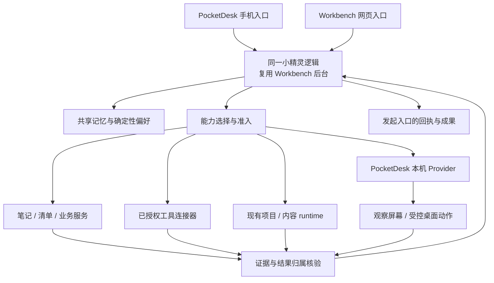

<!--
[INPUT]: 主架构/能力/记忆专项 v0.3、A/B/C 交付台账、用户提出的查用量/记清单/桌面操作场景
[OUTPUT]: 统一助手的产品职责、能力发现和任务选路、GUI 反馈闭环、记忆消费及下一阶段验收建议
[POS]: 面向产品与实施的解释和设计补充；不替代唯一 wire schema，不表示新能力已实现
[PROTOCOL]: 变更时更新此头部，然后检查 CLAUDE.md
-->
# 一套小精灵如何连接多个入口和执行能力

版本：v0.1 · 2026-09-19。目标设计与实施建议；当前状态以事实基线及交付台账为准。

## 1. 产品角色与实现落点

用户面对的是同一个小精灵，按同一可信身份使用经授权的记忆、能力与任务事实。用户只需说目标，必要时指定设备、项目或执行器，不必选择内部通道。

| 角色 | 提供什么 | 当前实施落点 |
|---|---|---|
| 统一助手逻辑 | 理解目标、检索相关记忆、选择能力、执行准入、汇总真实结果 | 复用 Workbench 助手入口和既有业务/项目/内容服务；不是第三个新服务 |
| Workbench 网页 | 对话入口、笔记/清单/任务/知识/记忆的管理和成果工作台 | 现有网页；其后台同时承载统一助手与业务服务，不能将整个 Workbench 理解为只有网页 |
| PocketDesk | 手机入口、桌面展示、Mac 上的观察与受控执行 | Bridge 转发请求，Provider 调用现有执行器；迁移完成后不再独立做同一任务的总决策 |
| 专用工具与外部执行器 | 账号查询、特定软件业务接口、项目执行、文本处理或 GUI 投递 | 逐 adapter 准入；同一个软件的这些通道分别登记，不由名字推断能力 |

两个入口可以发起同一种能力，但权限、设备在线状况和已验证范围可能不同。同一用户的两个入口不等于所有聊天合并；会话/项目/设备与账号仍有明确边界。

手动鼠标、键盘、画面和专用解锁仍直达 PocketDesk，不等待助手或 Workbench。自然语言要求“替我操作电脑”才进入统一助手的任务选路。

## 2. 用三个场景固定调用关系

| 用户目标 | 优先执行路径 | 什么才算交付 |
|---|---|---|
| 查 Codex 当前剩余用量 | 已授权、已接入的对应账号查询工具；若只支持 GUI，则走明确允许的页面观察路径 | 来源、账号范围、查询时间、各用量窗口及重置时间；缺失值为未知，不猜剩余额度 |
| 记一个清单 / 加一项 | PocketDesk → 统一助手 → Workbench 原清单服务 | 原清单/条目 ID、内容读回、手机可访问；重复提交不建两份 |
| 让电脑软件执行任务 | 统一助手识别具体能力，选择软件接口、已准入 runtime 或 PocketDesk 本机 adapter | 按目标验收；打开应用、投递文本、对端完成项目分别给不同结果 |

“查用量”需要先明确查的是供应商账号剩余额度，还是 Workbench 已记录的任务消耗；二者不等价。账号/产品存在歧义才询问，否则使用可信绑定。拥有某个 Codex 会话中的查询工具，不意味着 Workbench 或 PocketDesk 已能直接调用该工具；必须有正式、可认证的连接器与真实集成验收。不得从 CLI 名称相同或某助手能调用推断已共享。

当工具不可用时，读屏是独立能力而非无条件替补。若用户明确要求通过 GUI 检验某界面，则尊重该执行方式。不能为了完成只读查询自动登录、解验证码、变更套餐或重置额度。

## 3. 能力不是靠模型猜出来的

已有三层保持不变：Capability 描述目标与完成证据，Binding 描述提供者/账号/设备/通道，Readiness 描述何时、在哪个范围验证过。

新增 adapter 必须登记：输入输出、真实支持范围、完成证据、权限与目标绑定、可用性来源、取消/重试/未知结果处理。只向当前主体和入口展示允许发现的能力，按任务检索相关候选，避免每次把所有工具全文塞进模型。

路由步骤：
1. 明确请求目标与需要的完成标准，解析账号/设备/项目；有多个合理目标且会影响执行时再询问。
2. 取相关能力和适用记忆，过滤未授权、未接通、设备离线、观测过期或范围不符的 binding。旧成功不能覆盖新失败；这正是 B 尚待修复的问题。
3. 在符合条件的路径中应用本次明确指定 > 已准入项目规则 > 用户长期执行偏好 > 默认策略。明确点名的执行器不支持时说明原因，不私自换家。
4. 默认选择能给出可靠业务回执且副作用更小的路径：业务接口/专用工具优先于等价 GUI；可追踪项目 runtime 优先于只会桌面投递的通道。成本、延迟只在合格候选内比较。
5. 简单读写直接调用；长任务复用现有 runtime。桌面动作执行前再次核对设备、窗口、控制租约与权限。
6. 核对结果归属和目标证据；沿原请求回到入口。失败、结果未知与通知未送达分开，未知副作用先查账，不换路径重做。

每次保留简短可解释依据，例如“这次使用这台 Mac 的桌面适配器；目标软件无已接入查询接口”。界面只在用户需要判断时显示，不要求用户日常选通道。

## 4. GUI 观察与动作反馈闭环

当前 agent.gui.submit 只表达受控投递；后续需要的“看见软件回应并继续操作”不能冒充已具备，也不能直接放宽它的 succeeded 或 externalRunId 规则。

建议后续单列 GUI 观察/执行批次：
- 观察：目标应用与窗口身份、采集时刻、设备、界面文本或必要截图；优先结构化可访问性信息，图像理解补充，均受本机权限控制。
- 动作：选择目标 → 新鲜观察 → 一个受控动作 → 重新观察 → 按预期结果核验。界面变化或用户接管后旧坐标/旧窗口依据失效，停止或重新观察。
- 证据：区分“点击已发出”“看到页面数值”“已核验业务结果”。屏幕上另一个助手声称完成，不能直接代替项目文件/业务记录的验证。
- 限制：固定最大动作次数、时间和模型预算；锁屏、权限缺失、反复无进展、目标漂移时明确停止；同一桌面副作用由现有控制租约串行仲裁。
- 安全边界：页面与截图文字属于外部数据，不能修改系统指令、授权和长期记忆；只采集任务必要内容，不将截图持续上传或默认长期保存。
- 恢复：刷新后重新观察；可能发生的写入结果未知时先查证，不能因截图没更新就再次点击提交。

GUI 观察的专用能力命名、输入输出与证据引用需要走下一版统一 schema 和 TS/Swift 同组验收。当前冻结 14-ID 包不修改、不暗加字段。通常是新增 adapter/能力和样例；涉及持久多步恢复或跨执行者交接时才单独评估编排扩展，不能承诺所有未来场景都只是配工具。

## 5. 共享记忆怎么用

| 信息 | 权威归属 | 示例与规则 |
|---|---|---|
| 普通长期偏好/事实 | Workbench 现有记忆服务 | 回答用中文、某项目背景；显式记住或用户采用后生效 |
| 结构化执行偏好 | Workbench 现有 execution-preferences，经统一管理服务包装 | 默认执行器/模型；项目规则需新增验收，不能用文字偏好伪装已支持 |
| 当前会话/任务上下文 | 会话与原任务系统 | “刚才那个清单”、当前轮次、进行中的任务；跨入口续办用明确任务引用，不猜“最近一个” |
| 能力和实时环境 | 能力观测、本机 Provider | 哪台电脑在线、权限、窗口、账号剩余额度；带时效，不当永久记忆 |
| 笔记/清单/产物 | 原业务服务 | 业务数据可检索引用，不能只存进聊天或长期记忆代替保存 |

PocketDesk 只保存必要缓存与待提交草稿，不建第二个长期记忆权威。每次按可信身份、项目、任务检索少量相关记录；每条有来源/范围/版本/失效与删除语义。“这次用 X”不覆盖长期偏好；记忆可影响选路，不能增加权限。

两个入口编辑同一条记忆采用版本冲突检查；停用后新决策不再命中，离线不能凭旧缓存自动执行。历史任务保留必要的当时决策依据，撤销记忆不等于取消在途任务。

自动从每次任务学习经验、夜间整理和经验晋级仍属于后续 S12/S13/S21，先证明显式记忆跨入口一致再推进；不以向量库或存更多聊天记录代替这些语义。

## 6. 接下来按可验证场景推进

1. 收口 G0：修复并验收 B；保存 A/C 协议通过证据；核实实际部署主机、数据权威、认证与设备绑定。补清来源/能力/权限矩阵，不直接启用写操作。
2. G1：先用 note.create 验证跨端身份、一次写入、回包丢失查账、手机成果访问。这是基础链路验收，不替换现有桌面功能。
3. G2 高频交付：创建/追加清单，同一 owner 的记忆读取/修改/撤销，两入口返回同一业务记录与偏好。
4. G3：接原本机只读网页/打开应用/书签/GUI 投递，守住现有手机体验。另安排只读查用量小闭环：先核实是否有可正式接入的工具，缺少时不声称已接通。
5. GUI 后续独立批次：目标页面观察→数值读回，随后再扩展受控动作→观察反馈；每批独立验收，不把“看屏幕”当成通用桌面自治已完成。
6. G4：达到现有日常路径无退化与故障恢复标准后，对新请求默认统一，旧本机模型循环停止接新任务、在途收尾；保留原执行器与手动通道。

每个场景验收同时写正向与失败例：工具不存在、错误设备、身份不同、记忆冲突、旧成功后新失败、窗口变化、回包丢失、未知结果重试、离线再连接。边界稳定和增量验收能降低架构返工，不能保证所有未来需求都无需演进。
