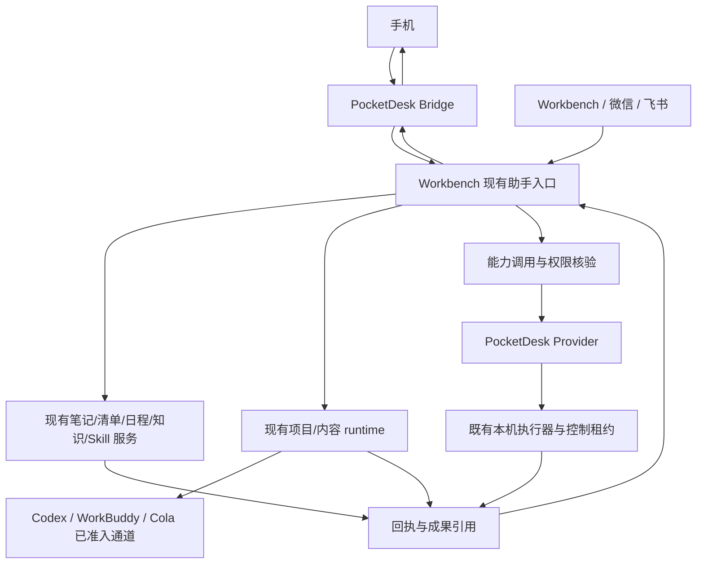

<!--
[INPUT]: Workbench 既有整体方案与愿景裁决、两端源码事实基线、统一方案评审
[OUTPUT]: 单一助手的产品边界、现有底座复用、跨端调用和分阶段迁移契约
[POS]: PocketDesk 接入 Workbench 的主架构；不替代 Workbench 九环节产品总方案，不宣称新链路已实现
[PROTOCOL]: 变更时更新此头部，然后检查 CLAUDE.md
-->
# PocketDesk × Workbench 统一小精灵技术架构

版本：v0.3 · 2026-09-19。状态：修订后的实施设计，尚未改变生产执行链。

先读 [现状与关系说明](current-state-and-integration-baseline.md)。它回答已有规划做到哪里；本文回答如何接入、复用什么、哪些边界不能突破。v0.1 中的旧运行快照不作为当前部署证明。

产品角色、路由选择及 GUI 观察扩展见 [产品与路由说明](assistant-product-and-routing.md)；该补充不更改当前冻结 wire，也不宣称新工具已接入。

## 1. 产品定义

最终是一个逻辑助手，保留两个协作程序：

- **Workbench**：统一的助手入口逻辑、业务记录、长期记忆与执行偏好、业务任务、执行准入、现有项目/内容 runtime、产物与通知。
- **PocketDesk**：手机输入与结果入口、桌面小精灵展示、本机能力提供者、明确受限的离线工具。
- **Codex / WorkBuddy / Cola / ZCode**：外部执行者，经各自适配器获得任务允许的输入和能力，不接管总任务事实。

桌面球体是交互与展示，Assistant Core 是既有服务职责的总称，不意味着新建一个服务、进程或通用 Agent 框架。

实施行动与退役标准见 [接入与切流门禁](integration-gates-and-rollout.md)，包括部署核实负责人、书签/甩送/桌面展示覆盖与无退化切流条件。

### 三类请求分别走哪里

| 请求 | 目标路径 | 完成标准 |
|---|---|---|
| 手动看屏、触控板、键盘、草稿同步、专用解锁 | 手机 → PocketDesk 原三通道及专用入口 | 原执行器真实回执；不经过模型或 Workbench |
| 问答、创建笔记/清单、查日程 | 手机 → PocketDesk Bridge → Workbench 助手/业务服务 | 回答或真实业务记录；不强制创建 Agent 长任务 |
| 项目执行、内容处理、自然语言桌面操作 | 同一 Workbench 助手按能力选择现有 runtime 或 PocketDesk Provider | 按实际任务交付条件判断，不以模型文字判断 |

不改变用户已明确授权的低风险操作语义，不为每个请求额外增加确认或审核模型。

## 2. 继承既有规划，冻结本轮技术边界

上位产品方案：[Workbench overall-plan](../../workbench/docs/assistant-overall-plan.md)；技术裁决：[愿景附录 B/D](../../workbench/docs/workbench-vision-v1.md)。

| 现有基础 | 本轮决策 |
|---|---|
| Fastify + TypeScript + SQLite、Vite/React | 继续使用，不换数据库/前端/服务框架 |
| PocketDesk Swift + 原手机 Web | 保留，不重写桌面执行器 |
| chatWithAssistant、直接业务工具与确定性快路径 | 新渠道接入同一服务；不复制理解/路由循环 |
| agent_tasks、项目 jobs、内容 jobs、通知台账 | 复用并补关联；不强制迁移到新通用任务表 |
| Stage A 绑定会话与 runtime_partition | 保持原授权与分区，不因新渠道自动继承 |
| 原生 Codex 续接、内容换手、用量与 Skill 捕获 | 作为回归基线，不重复开发或降低能力 |
| 临时状态、窗口、焦点、录屏、控制租约 | 保留 PocketDesk 权威，不纳入长期记忆 |
| RunStep / Temporal / workbenchd / 向量库 | 不作为首版前置；保留已确认的暂缓裁决 |
| Supabase 旧同步 | 不随本接入下线；本地承载迁移另验主库、附件、备份与回滚 |
| B/C 编排底座对照 | 本次不替代旧决策流程；先接现有 Workbench 实现，不增第二个正式调度者 |

统一概念不等于统一所有物理表。业务清单 `tasks`、Agent 委派 `agent_tasks`、对话消息和能力回执保持各自语义，只建立必要引用。

## 3. 部署拓扑先核实，不把转发端口当同机服务

2026-09-19 首轮观察中，本机 8787 健康端点可访问，但监听者为 UURemote；当时本地仓库未找到默认数据库。该观察不等于当前持续运行事实。真实 Workbench 可能经转发访问，主机和运行版本尚待核实。

接入前必须形成 deployment manifest：Workbench 实际主机与运行版本、PocketDesk helper 所在 Mac、数据与附件根、服务地址、信任边界、进程保活、备份恢复和断网/睡眠行为。不得包含密钥正文。

- **确认同机后**：首选 HTTP loopback + 双向用途独立的 scoped credential；Provider 新监听器仅绑定 loopback，不复用对局域网开放的控制端口来假装本机隔离。
- **若实际跨机**：先做独立部署决策；PocketDesk 可通过认证的主动出站通道领取 invocation/回传 receipt，远端不能把自身 loopback 当作本机 Mac。认证传输、设备路由、断线恢复须验收后启用。
- 首版确定一种拓扑，不同时实现多套传输。不假定现有 UU/Tailscale 连接已经提供应用级主体、权限、幂等或设备撤销。

Bridge 业务协议与 HTTP/长轮询/事件流解耦。拓扑尚未确定时可做只读协议准备，不能开展真实写入切换。

## 4. 谁调用谁

### 四个具体例子

1. **“帮我记一条笔记”**：手机 → Bridge → Workbench 现有笔记服务 → 笔记 ID/版本/可访问成果；不调用外部 Codex，不在 PocketDesk 建第二份笔记。
2. **“打开这台 Mac 的浏览器”**：手机 → Workbench 助手 → PocketDesk Provider → 原打开应用执行器；权限、设备和结果在本机核验。
3. **“让 Codex 修改这个项目”**：Workbench 准入检查授权项目、入口、模型和写入开关 → 原项目 runtime → Codex CLI → 独立验收 → 原入口交付。新手机入口默认不冒充 Stage A 的 workbench 来源。
4. **“把这段发到 WorkBuddy 桌面”**：Workbench → agent.gui.submit → PocketDesk GUI adapter。只报告桌面投递/结果待确认，不报告项目完成。如果用户要求 WorkBuddy 自动改项目，而项目通道未接通，不能擅自改走 GUI 并报告同等能力。

## 5. 入口、会话、主体与授权

Workbench 当前 InboundSource 仅含 workbench/weixin/feishu；必须显式扩展 pocketdesk，不能伪装为微信兼容入口。桥接入站引用原 request、消息、会话、设备与附件；服务端从凭证解析 principal，客户端声明不是身份依据。

- 首版沿用单 owner 模型；Workbench 既有用户记录为映射来源。
- 当前 PocketDesk 共享配对 token 不具备逐设备身份。逐设备管理需另建凭证，否则 UI 明确是共享配对身份，不虚构“已隔离设备”。
- PocketDesk 不携带 Workbench 管理主 token。服务凭证限制 audience、能力、资源、有效期和撤销；接收回执时核验调用归属，不能接受其他任务伪造结果。
- 同一主体不等于同一会话；task 查询、产物下载、记忆列表和取消均检查资源权限。
- 微信/飞书旧身份不因文本相同自动并入 owner；历史会话引用保持原来源。
- 执行确认绑定动作参数摘要、目标、主体和有效期；既有授权可复用，不能信任 `confirmedAt` 自报。
- 主体授权、入口权限、项目写权限和本机控制租约分别核验。权限撤销即时影响下一次副作用；历史决策快照不构成永久权限。

### 入口×能力准入

统一 Core 只复用逻辑，不自动扩大入口权限。新 pocketdesk 来源首批仅开放笔记/清单能力，随后逐项验证本机调用；Codex 绑定会话续接、内容换手、外发等按现有来源限制分别接入并验收。不可用时明确返回原因，不把来源字段改成 workbench 绕过旧检查。

## 6. 事实归属与请求关联

| 数据 | 权威位置 | PocketDesk 保存什么 |
|---|---|---|
| 对话与请求接收 | Workbench 现有会话 + Bridge 接收记录 | 提交 outbox、远端引用及显示缓存 |
| 业务笔记/清单/知识/Skill | Workbench 原服务或明确外部系统 | ID、版本、访问引用 |
| Agent 长任务、attempt、执行与审核 | Workbench 现有任务及 jobs/events | 远端只读投影，不推进业务终态 |
| 本机 invocation 与副作用证据 | PocketDesk 持久调用账本 | 执行占用与真实回执；Workbench 消费投影 |
| 长期记忆与执行偏好 | Workbench 现有存储演进 | 只读缓存；不可离线改成第二权威 |
| 焦点/窗口/控制租约 | PocketDesk 实时执行器 | 原有状态，不跨端复制为实时真值 |
| 画面与鼠标 | 原 ScreenCapture/CursorMonitor | 原三通道，不进 Assistant Core |

每个入站请求有稳定 requestId；远端持久接受后返回 receiptRef，并在确实创建 Agent 长任务时返回 agentTaskId。短业务调用可以关联业务记录和调用回执，不强塞进 agent_tasks。

PocketDesk 原任务历史保留；新跨端投影使用显式 remoteRef/authority，原本机 TaskService 不得执行远端请求。任务权威切换只作用于新请求，已有任务由原负责人收尾。

## 7. 能力、调用、回执与状态

唯一字段契约见 [能力层规格](unified-assistant-capability-plan.md)，本文不复制第二份 TypeScript 类型。

- Capability 定义“做什么”，AdapterBinding 定义“谁在哪台设备通过什么通道实现”，ReadinessObservation 定义“何时在哪个范围证明可用”。
- GUI 投递、CLI 文本生成和项目执行是三个能力；一个执行者可有多个 binding。
- readiness 当前可用性与验证证据分开；账号失效、版本/设备/权限变化后重新核验。
- 任务状态、能力调用状态、产物验收状态和通知送达状态分别保存。
- GUI 调用可达到 submitted_untracked；上层项目目标保持未核验。若用户目标仅为投递，可说明“已投递”，仍不宣称对端接收或完成。
- 无产物的状态动作以真实 observed_state 验证；不机械要求每次查询都创建文件。

程序做确定性读回；复杂成果按原 runtime 审核。不为笔记保存新增第二轮大模型审核。

## 8. 幂等、事件和恢复

1. 入站唯一键是 principal/channel/requestId，同键不同规范化内容或附件指纹返回冲突。
2. operationId 标识业务副作用，重试与查账保持稳定；invocationId 标识具体调用，attempt 沿用原任务轮次。网络重传不能直接增加 attempt。
3. Workbench 自有业务写入、operation 去重与提交回执在同一事务；外部系统按对端幂等键/查询能力处理，不承诺跨系统 exactly-once。
4. 本机副作用前持久占用。占用后崩溃或 GUI 结果未知时保守 uncertain，不自动释放占用重发。
5. 回包丢失先查原 operation/invocation；未知不是失败，新 attempt 不得绕过已有未知副作用。
6. 事件包含归属 ID、事件 ID/服务端序号和 revision；去重、拒绝旧 revision 覆盖、合法转换校验。时间戳仅显示，不能决定顺序。
7. 事件游标过期或缺段时返回快照与新游标，不从零重跑。迟到旧轮记录保留审计，不更新新轮主状态。
8. 取消请求不等于停止；尚未执行可取消，已投递 GUI 返回 cannot_recall，本地进程停止不能冒充远端停止。
9. 已交付成果保留；通知失败只重试通知。unknown 外发不盲重发。
10. 原任务换手复用已实现内容路径；整任务切换与领取的并发/事务边界需专项通过，不能因协议统一放宽限制。

首版不引入通用 RunStep。将来确有分步局部恢复需求时单独评估；invocation/operation 只是调用账本，不是另造 DAG 调度器。

## 9. 离线和服务不可用

- 手动三通道与已具备权限的确定性本机操作继续可用。
- 长期记忆只读；过期缓存不参与自动副作用路由。
- 新业务输入保存本地待提交草稿，恢复后由明确提交动作发起；不自动回放过期意图。
- 已提交但响应丢失的请求保留 pending/uncertain，查询原 requestId；不能因超时交给本机 Agent 再执行。
- 迁移期本机 Agent 兼容模式只接明确归属本机的新任务，不写 Workbench 业务或共享记忆，不接管远端在途任务。
- 睡眠、锁屏、进程退出与断网分别展示，不把 unavailable 当授权撤销，也不让恢复自动取得桌面控制权。

## 10. 上下文、交付、通知和成本

- ContextRef 必须携带来源、版本、可信级别、大小与有效期；外部网页/文档内容仅为数据，不成为系统指令或写记忆授权。
- 本机绝对路径不能直接交给远端或手机；附件上传/下载按资源鉴权，禁止任意路径读取。当前页面与窗口绑定在执行前复核。
- 手机打开产物走经鉴权的 Bridge 代理或受限成果入口；不把远端 localhost URL、裸相对 API 或管理 token 链接当交付。
- 保存成功与通知成功分开；原入口默认短回执，完整内容进入成果详情。
- 继承请求模型、真实报告模型、输入/输出/缓存和未知用量口径。Bridge 的确定性转发、查状态、补事件不消耗模型。
- 超时、并发、上下文大小、模型调用/返工额度使用现有配置并写入快照；共享桌面资源由 PocketDesk 租约仲裁，不因 Workbench 可并发就允许并行抢焦点。

## 11. 实施顺序与验收门禁

以下 G 阶段统一替代旧文件相互冲突的 M0/Phase 顺序；不替换 Workbench 原 S01–S22 产品路线。

| 阶段 | 实施内容 | 通过标准 |
|---|---|---|
| G0 事实与协议 | 部署清单、旧能力基线、能力映射、单一 JSON Schema、只读发现 | 不改执行；Swift/TS 样例一致；能力范围可解释 |
| G1 首条业务闭环 | 新 pocketdesk 入站、单 owner 绑定、request 查账、note.create | 手机创建仅一份；回包丢失/重启仍找回原成果；手机可鉴权打开 |
| G2 业务与记忆收敛 | note.append/checklist.create/add_item；现有记忆与执行偏好迁移投影 | 追加不重复；版本冲突不覆盖；删除/撤销两端生效；旧能力不倒退 |
| G3 本机 Provider | 先 browser.current.read，再 desktop.app.open，再 agent.gui.submit | 真控制租约、焦点、持久占用；未知不重发；GUI 不冒充业务完成 |
| G4 默认统一与恢复 | 逐能力新请求切流、入口续办准入、退回开关、旧模型循环退役 | 日常桌面路径无退化；每任务单一负责人；恢复不双执行；旧 loop 停接新任务、在途收尾、观察与回滚通过，详见门禁补充 |
| 独立后续 | WorkBuddy 项目通道、通用复合步骤、学习闭环 | 各自准入和真实成果验收，不阻塞 G1–G3 |

G0 协议可先行；部署核实行动与其并行，未通过不能进入真实写入和传输装配。G1 增量上线不替换现有桌面操作入口。

首包只做 G0。协议设计中的字段不等于已落地 API；G1 起每个写能力都有独立故障注入与旧行为回归。

## 12. 迁移、回滚和变更约束

- 数据只做兼容追加，先备份数据库/附件及配置，验证恢复；不直接复制两个库互相覆盖。
- Registry 先读既有登记/探针/adapter，Policy 先包装原实际执行入口，避免形成两套可漂移授权。
- 记忆迁移包含普通记忆和 agent_execution_preferences 两个来源，详见记忆规格；明确迁移版本和幂等键。
- 切流按能力与新请求启用。回滚只关闭新接入，不重派已执行请求；旧程序不可丢弃新调用账本，必须仍可查账或导出恢复。
- 本轮不改变项目写权限、全局模型、已授权业务确认规则和 Skill 保存策略。旧实现有争议时独立列问题，不在 Bridge 里隐式“修正”。
- 涉及数据库/框架/runtime/部署拓扑/任务权威的变化必须形成独立决策记录，说明复用不足、影响、迁移和回退，不夹带实施。

## 13. 旧总方案的完整性对照

两端统一只改变入口与能力连接，原九环节不能在新版中遗漏：

| 原环节 | 本轮承接 | 尚未完成的范围 |
|---|---|---|
| 接收与身份 | pocketdesk 新来源、可信映射、去重 | 逐设备身份与部署验收 |
| 理解与上下文 | 同一 chatWithAssistant、ContextRef | 任意跨会话自动关联不承诺 |
| 处理方式选择 | 直接工具/项目 runtime/内容 runtime/Provider | 通用动态选路未完成 |
| 必要规划 | 保留简单直接执行与既有专用流程 | 通用多成果步骤计划暂缓 |
| 调度执行 | 保留现有两类任务池、分区、并发与桌面租约 | 不是三家各自会话池全验收 |
| 过程与异常 | 回执、原任务续办、内容换手、查账 | 项目任意换人和所有入口续接未完成 |
| 成果验收 | 复用原独立审核与确定性读回 | WorkBuddy 项目通道另过准入 |
| 保存与通知 | 原产物服务、手机鉴权入口、通知独立恢复 | 跨设备真实访问与外发仍须验收 |
| 经验复用 | 显式记忆与执行偏好统一 | S12/S13/S21 学习、试用与效果验证仍待建设 |

WorkBuddy 项目执行的独立准入要求：真实项目/worktree 隔离、明确文件与网络权限、稳定运行身份、事件与轮次关联、成果验证、真实停止范围、超时重启与迟到回执、独立验收。若不支持原生 resume，产品必须明确禁用续接，不得伪造；若整体条件不能满足，就保持文本/受限文档能力。注册表启用、桌面登录、单次探针成功都不能替代这一准入。

## 14. 必须验证的遗漏防线

- 新入口主体伪造、跨会话/项目读写、回执伪造与撤销后的调用。
- 同键异参、提交成功回包丢失、占用后崩溃、跨 attempt 重试与乱序回执。
- 本机/远端任务并存时唯一执行权；远端超时不能触发双执行。
- 旧 S04/S08/S11/S16/S17/S19/S20、内容换手与三条手动通道回归。
- 记忆版本冲突、删除/过期缓存、旧 transcript 重新带入、执行偏好与普通记忆冲突。
- 手机成果访问、附件权限、通知单独恢复、成本缺失和预算停止。
- 配置/版本不兼容、睡眠唤醒、磁盘满/写入失败、服务重启与备份恢复。

测试证据注明源码版本、部署版本、替身/真实调用、环境和限制。尚未执行的验收必须保留“未验证”，不以文档完整性代替运行可靠性。
